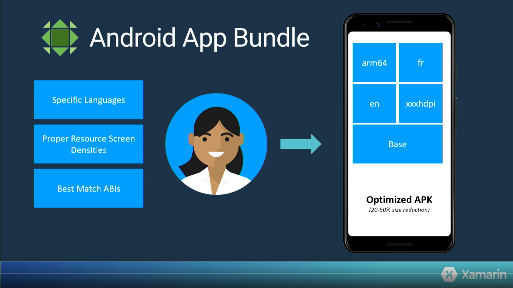
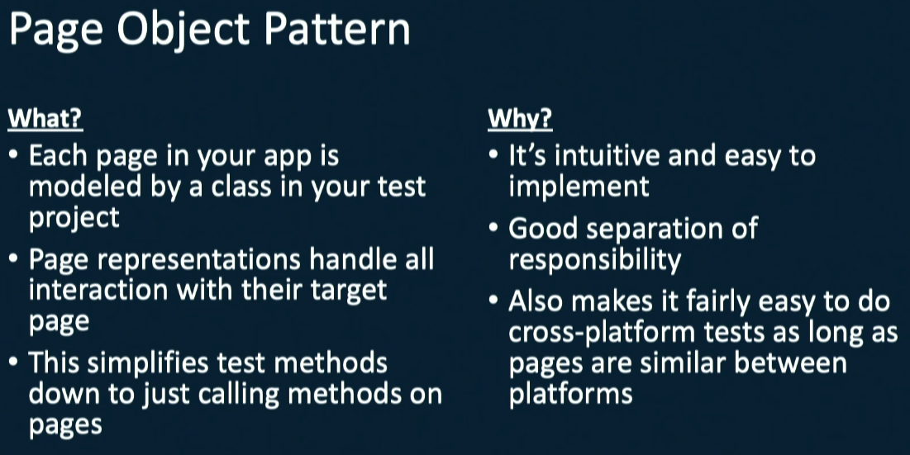
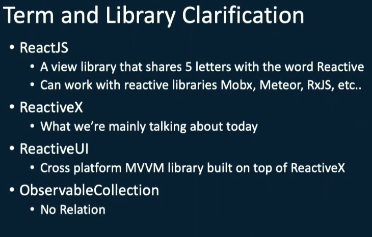

# Xamarin Summit 2019

:warning: STILL WORK IN PROGRESS :warning:

Recap of Xamarin Summit 2019

:octocat: [Xamarin Summit GitHub](https://github.com/xamarindevelopersummit/XamDevSummit2019)

This is my very own interpretation of the summit. I may be missing some info I did not find relevant in my case, but it doesn't mean that it was not interesting.  
If you think that some major info is missing out, feel free to submit a PR! I'd be glad to accept it!

Recap by **Maddy Leger** [here](https://devblogs.microsoft.com/xamarin/recapping-xamarin-developer-summit/)

---

# [DAY 1](https://www.youtube.com/watch?v=YJ8TiRCsLl4)

## Future of Xamarin with [James Montemagno](https://twitter.com/jamesmontemagno) :star: Love this guy!
[Link to summit session on YouTube](https://youtu.be/YJ8TiRCsLl4?t=996)

- iOS 13: Coming to Xamarin soon!
- Android App Bundle for Xamarin


Package all resources for your app while uploading the application to AppStore. When a user download the app, Google produces an optimized apk for this specific user.

- Startup Tracing: Improve application startup time by 100% and reduce artefact size
- AndroidX: Google refactoring of Android support libraries

## Cross-Platform Everything with [David Ortinau](https://twitter.com/davidortinau)
[Link to summit session on YouTube](https://youtu.be/YJ8TiRCsLl4?t=2425)

- Xamarin.Essentials: More platforms supported in the future, watchOS, tvOS, Tizen, ...

- Xamarin.Forms Open Source Evolution


And more interesting things on Xamarin.Forms, how they works on meeting our needs and unifying experiences between platforms.

- Quick introduction of the power of Shell. A dedicated session is planned on day 2 with James
- CarouselView is coming soon (already available as preview)

## Developer Productivity with [Maddy Leger](https://twitter.com/maddyleger1)
[Link to summit session on YouTube](https://youtu.be/YJ8TiRCsLl4?t=3746)

- Improve code editor in Visual Studio for Mac
- XAML IntelliSense in Visual Studio for Mac
- IntelliCode
- Android XML fully supported
- Building time improved
- **Hot Reload** :fire::repeat:
  - Change your XAML, save, look at your updated UI on your device!
  - Works with all frameworks (Prism, etc.), with big existing apps
  - Works both on Windows and Mac, out of the box, no setup needed!
  - Don't crash VS, or your computer, or the plane you're in, if you misspell something.


This is still in private preview though.

## Speed Up Android Build Times & Shrink APK Sizes with [Jonathan Peppers](https://twitter.com/JonathanPeppers)
[Link to summit session on YouTube](https://youtu.be/YJ8TiRCsLl4?t=5910)

This technical session explains how Android build works and all build options.  

## What's New For Xamarin Developers in Visual Studio with [Maddy Leger](https://twitter.com/maddyleger1)
[Link to summit session on YouTube](https://youtu.be/YJ8TiRCsLl4?t=9355)

This session extends the first one of Maddy. No new information, but some examples and cool demos.

## Page Object Pattern and UITest Best Practicies with [Sweekriti Satpathy](https://twitter.com/SweekritiS)
[Link to summit session on YouTube](https://youtu.be/YJ8TiRCsLl4?t=16514)

- State of UI Tests today


- What is **Page Object Pattern**

Basically, each page of your app should be an object in tests.  
How we used to write tests:
```csharp
[TestFixture]
public class Tests
{
  [SetUp]
  public void BeforeEachTest()
  {
    // Set up app
  }
  
  [Test]
  public void LogInTest()
  {
    app.Tap(x => x.Id("log-in-button"));
  }
}
```
How we should to this now:
```csharp
[TestFixture]
public class Tests
{
  [SetUp]
  public void BeforeEachTest()
  {
    // Set up app
  }
  
  [Test]
  public void LogInTest()
  {
    new LogInPage().LogIn("user", "password");
  }
}
```
:octocat: Check out those examples on [GitHub](https://github.com/xamarin-automation-service/uitest-pop-example)

- In order to tweak your UI Tests, you can use [REPL](https://docs.microsoft.com/en-us/appcenter/test-cloud/uitest/working-with-repl?tabs=vswin) (read-eval-print-loop)

Sweekriti then made a clear and cool demo of how to write tests for an existing app. Totally worth watching.

## Streamline & Simplify Events with Reactive Extensions with [Shane Neuville](https://twitter.com/pureween)
[Link to summit session on YouTube](https://youtu.be/YJ8TiRCsLl4?t=20138)

Shane worked a lot on [ReactiveUI](https://github.com/reactiveui/ReactiveUI) prior working for Microsoft.



This session is really worth watching in order to catch what Reactive X is and how to use it. I will not write down everything here as it would mean writing down the whole session.

:octocat: Example source code can be found [here on GitHub](https://github.com/PureWeen/XamSummit2019)

## Crafting Real-Time Mobile Apps with SignalR with [James Montemagno](https://twitter.com/jamesmontemagno)
[Link to summit session on YouTube](https://youtu.be/YJ8TiRCsLl4?t=23715)

In this session, James introduce [SignalR](https://github.com/SignalR/SignalR), then shows a demo using it for creating a chat.  
Has I already used SignalR, this session was cool but I didn't learn anything new.

:octocat: Source Code on [GitHub](https://github.com/jamesmontemagno/XamChat)

## Partly Cloudy – Tips & Tricks to Using Azure to Its Fullest in Mobile Apps with [Matt Soucoup](https://twitter.com/codemillmatt)
[Link to summit session on YouTube](https://youtu.be/YJ8TiRCsLl4?t=27333)

This session shows how to use Azure for hidding secrets in the cloud instead of your app, how to secure your app and how to improve the performances.

:octocat: All demos code can be found [here](https://github.com/codemillmatt/xam-dev-summit)

---

# [DAY 2](https://www.youtube.com/watch?v=t1cQsenAmNo)

## GraphQL with [Brandon Minnick](https://twitter.com/TheCodeTraveler) 
[Link to summit session on YouTube](https://youtu.be/t1cQsenAmNo?t=18547)

**GraphQL** is a language for querying complex API by explicitly asking for what data we need without doing multiple REST requests. That's pretty cool!


We can play with GitHub API using GraphQL here :  
:octocat: https://developer.github.com/v4/explorer/

GitHub with example used in talk :  
:octocat: https://github.com/brminnick/SimpleXamarinGraphQL

## AppCenter with [Patrick Nikoletich](https://twitter.com/lbcpat)
[Link to summit session on YouTube](https://youtu.be/t1cQsenAmNo?t=22166)

Mainly talks about what AppCenter is, and the future of the product.

- AppCenter Auth which is a system for handling **[Azure AD B2C](https://azure.microsoft.com/en-us/services/active-directory-b2c/)** authentication.


- AppCenter Data: Connect your app with Azure CosmoDB
- AppCenter Push: Preview feature, send push notification to your app

## Xamarin.Forms Shell with [Shane Neuville](https://twitter.com/pureween)
[Link to summint session on YouTube](https://youtu.be/t1cQsenAmNo?t=25752)

Why does Xamarin.Forms Shell exists.


Source code of demo :  
:octocat: https://github.com/PureWeen/ReactShell/tree/master/Source

The demo shows how to use and customize Shell navigation. Really interesting!

--- 

# Things I noted from the summit

- Everybody at Microsoft use a PC AND a Mac for working with Xamarin
- [Vysor](https://www.vysor.io/) has been used for streaming smartphone screen to computer

