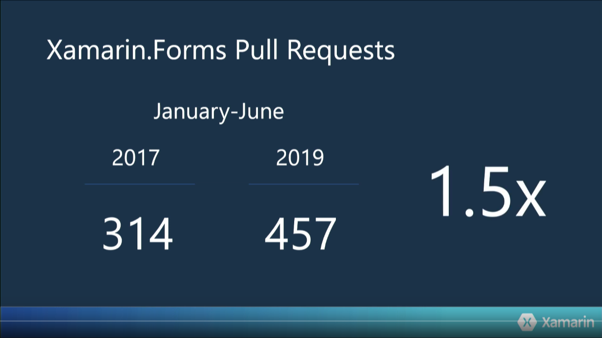

# Xamarin Summit 2019

Recap of Xamarin Summit 2019

[Xamarin Summit GitHub](https://github.com/xamarindevelopersummit/XamDevSummit2019)

---

# DAY 1

## Future of Xamarin with [James Montemagno](https://twitter.com/jamesmontemagno)
[Link to summit session on YouTube](https://youtu.be/YJ8TiRCsLl4?t=996)

- iOS 13: Coming to Xamarin soon!
- Android App Bundle for Xamarin

Package all resources for your app while uploading application to AppStore. When a user download the app, Google produces an optimized apk for this specific user.

- Startup Tracing: Improve application startup time by 100% and reduce artefact size
- AndroidX: Google refactoring of Android support libraries

## Cross-Platform Everything with [David Ortinau](https://twitter.com/davidortinau)
[Link to summit session on YouTube](https://youtu.be/YJ8TiRCsLl4?t=2425)

- Xamarin.Essentials: More platforms supported in the future, watchOS, tvOS, Tizen, ...

- Xamarin.Forms Open Source Evolution

---

# DAY 2

## GraphQL with [Brandon Minnick](https://twitter.com/TheCodeTraveler) 
[Link to summit session on YouTube](https://youtu.be/t1cQsenAmNo?t=18547)

**GraphQL** is a language for querying complex API by explicitly asking for what data we need without doing multiple REST requests. That's pretty cool!

We can play with GitHub API using GraphQL here :  
https://developer.github.com/v4/explorer/

GitHub with example used in talk :  
https://github.com/brminnick/SimpleXamarinGraphQL

## AppCenter with [Patrick Nikoletich](https://twitter.com/lbcpat)
[Link to summit session on YouTube](https://youtu.be/t1cQsenAmNo?t=22166)

Mainly talks about what AppCenter is, and the future of the product.

- AppCenter Auth which is a system for handling **[Azure AD B2C](https://azure.microsoft.com/en-us/services/active-directory-b2c/)** authentication.

- AppCenter Data: Connect your app with Azure CosmoDB
- AppCenter Push: Preview feature, send push notification to your app

## Xamarin.Forms Shell with [Shane Neuville](https://twitter.com/pureween)
[Link to summint session on YouTube](https://youtu.be/t1cQsenAmNo?t=25752)

Why do Xamarin.Forms Shell exists.

Source code of demo :  
https://github.com/PureWeen/ReactShell/tree/master/Source

The demo shows how to use and customize Shell navigation. Really interesting!
